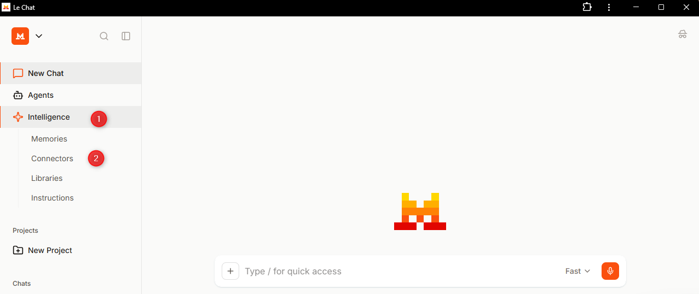
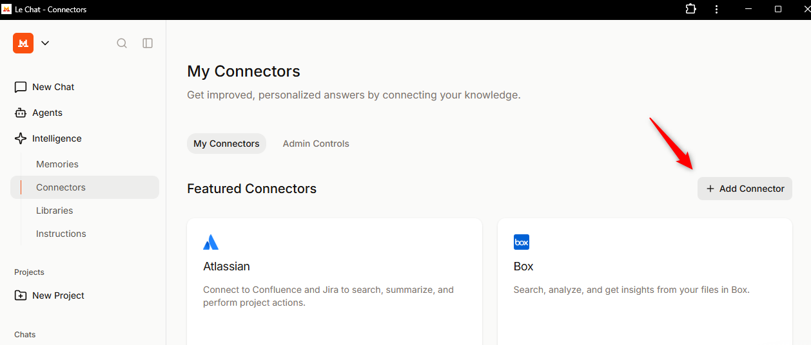
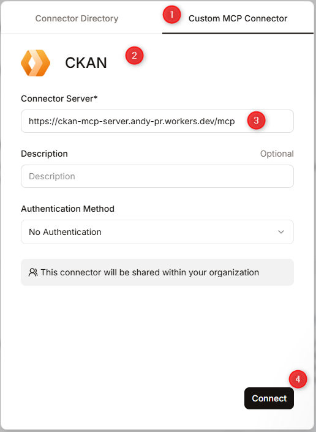
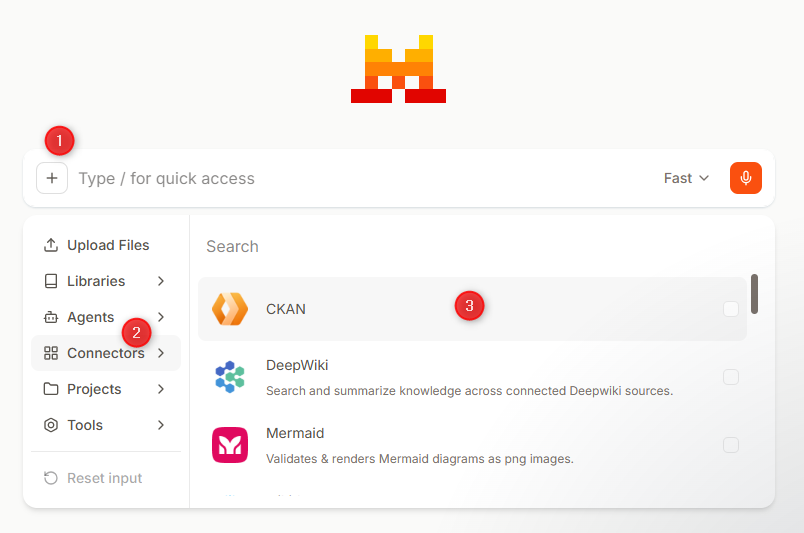
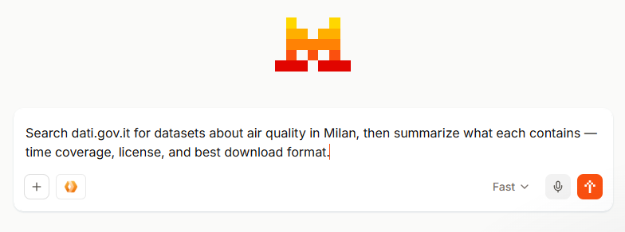

# Set up the CKAN MCP Server in Le Chat (Mistral)

This guide uses the public demo server, which has a limit of 100,000 calls per day shared quota across all users of this endpoint. For reliable usage, it is recommended to install the CKAN MCP Server on your own machine.

This guide shows how to add the CKAN MCP Server as a custom connector in Le Chat and use it in a chat.

## 1) Go to Connectors

In the left sidebar, click **Intelligence**, then select **Connectors**.

## 2) Add a new connector

On the **My Connectors** page, click **+ Add Connector**.

## 3) Fill in the connector details

Select the **Custom MCP Connector** tab, then fill in the fields and click **Connect**.

- **Name:** CKAN
- **Connector Server:** `https://ckan-mcp-server.andy-pr.workers.dev/mcp`

## 4) Enable the connector in chat

Open a new chat, click **+**, then **Connectors**, and enable **CKAN**.

## 5) Ask a CKAN question

Type your question and send it.

