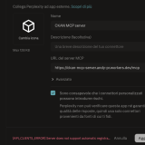

# Configuring CKAN MCP Server on Perplexity Pro
This guide explains how to integrate the CKAN MCP Server into Perplexity Pro using the Model Context Protocol (MCP). With this integration, you can query hundreds of open data portals (such as data.gov or dati.gov.it) directly from your Perplexity chat.

### Prerequisites
A Perplexity Pro account.

The MCP server endpoint URL (you can use the public one: https://ckan-mcp-server.andy-pr.workers.dev/mcp).

### Setup Procedure
## 1) Accessing Connector Management
Open Perplexity.

Click the "+" (Attach) icon in the message input bar.

Select Connectors & sources.

Click on Connect external app (or navigate to your Profile Settings > Apps to add a new custom MCP server).

## 2) Server Configuration
In the configuration screen **perplexity**, fill in the fields as follows:

Name: CKAN MCP Server

Description (optional): Connector to explore CKAN-based Open Data portals.

MCP Server URL: Enter the endpoint URL:
https://ckan-mcp-server.andy-pr.workers.dev/mcp

Consent: Check the box "I am aware that custom connectors can introduce risks" to confirm you trust the source. 

Save: Click the button in the bottom right to confirm.

*Note on errors*: If you see an error regarding "automatic registration," please double-check that the URL is typed correctly and that the server is currently reachable.
Select **No Authentication** on *Authorization Type* and **HTTP Streamable** for *Connection Type*.

## 3) Using the Connector
**Once added, the server will not appear in your list of available connectors**, probabibly because of a bug in UX/UI.

Click "+" -> Connectors & sources.

Enable CKAN MCP Server from the list **ckan_mcp_server** 
 
You can now start asking questions in natural language.

## 4) Example Prompts
Once the connector is active, Perplexity will use the CKAN server tools to provide precise answers:

"Search data.gov for datasets related to climate change in California and summarize the available formats."

"List the organizations available on the UK open data portal."

"Find datasets from the Italian Ministry of Health published in the last year."